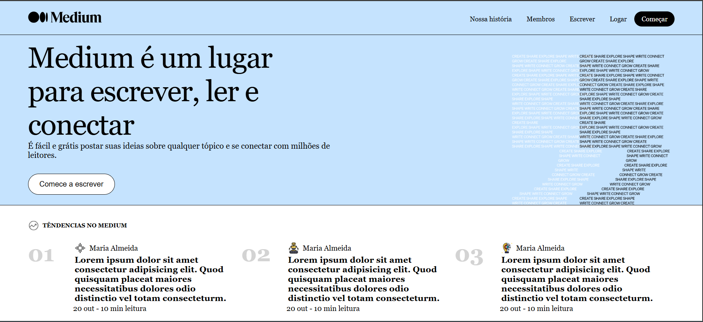

# Base Medium

Este é um projeto de estudo desenvolvido como parte de um curso de **Front-End**.  
O desafio proposto pelo professor foi recriar a estrutura visual do site **Medium**, utilizando **apenas HTML e CSS puro**, sem Flexbox ou JavaScript, para treinar conceitos clássicos de layout como **float** e elementos relacionados.

## 🎯 Objetivo do Projeto
- Praticar HTML semântico.
- Reforçar fundamentos de CSS.
- Criar layouts responsivos usando `float`, `position` e `display` tradicionais.
- Melhorar a organização de código para projetos estáticos.

## 🛠️ Tecnologias Utilizadas
- **HTML5**
- **CSS3** (sem Flexbox, Grid ou frameworks)
- Estrutura e estilização puramente manuais.

## 📸 Demonstração
 <!-- substitua pelo caminho real da imagem -->

> Caso queira visualizar, basta abrir o arquivo `index.html` em qualquer navegador.

## 📂 Estrutura de Pastas
Base-Medium/
├── index.html
├── estilo.css
└── /imagens

## 📚 Aprendizados
Durante o desenvolvimento, pratiquei:
- Organização e indentação de código.
- Uso de `float` para posicionamento de elementos.
- Criação de cabeçalho fixo.
- Centralização de conteúdo sem Flexbox.
- Boas práticas em HTML semântico.

## 🚀 Próximos Passos
- Adicionar responsividade para dispositivos móveis.
- Implementar interações simples usando JavaScript.
- Melhorar acessibilidade.

## 📄 Licença
Este projeto é de **uso educacional** e não possui vínculo com o site Medium.
